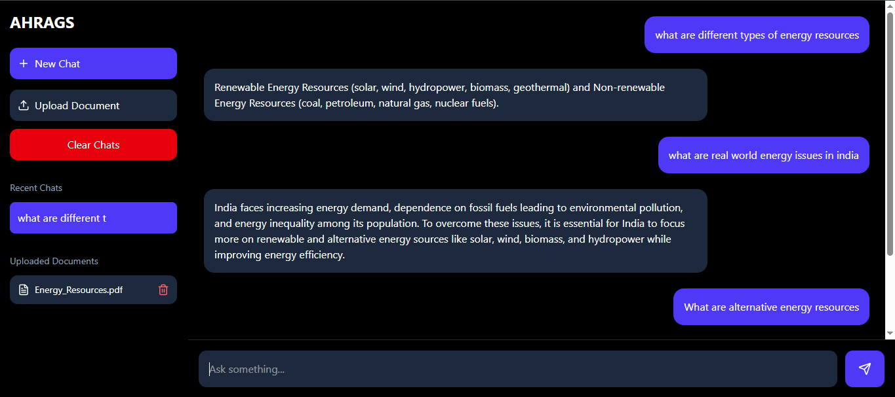
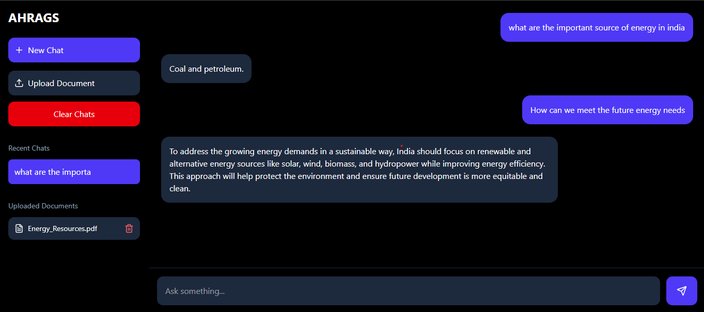
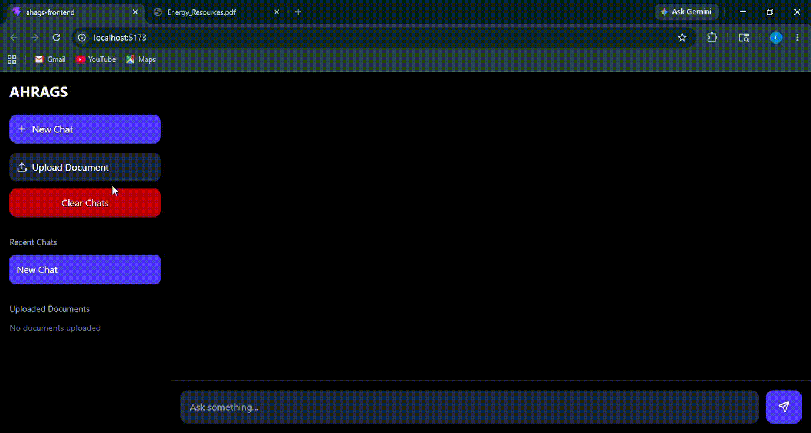
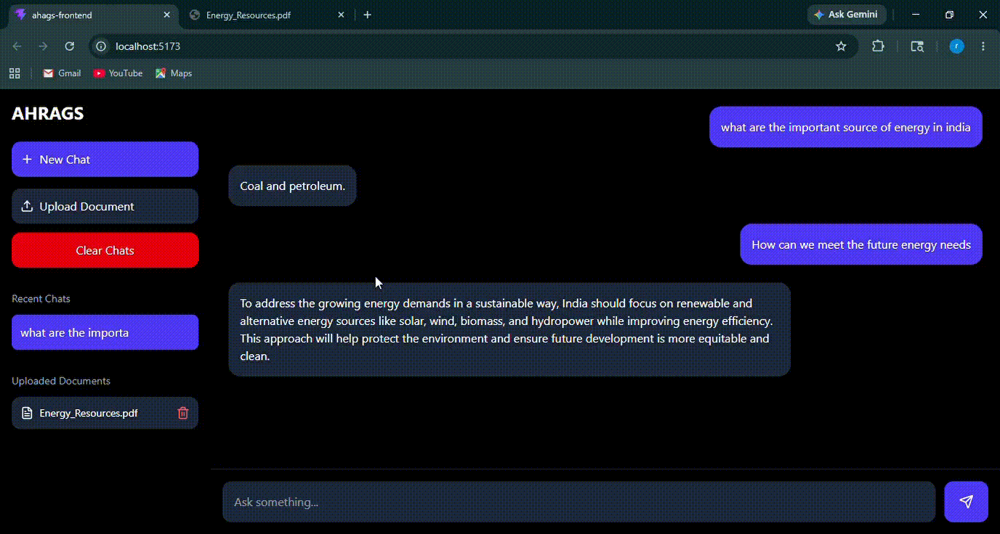
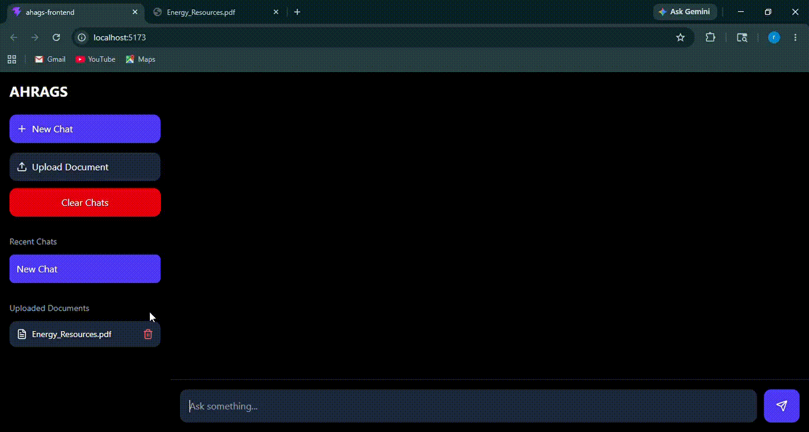

md
# Agentic Hybrid RAG Chatbot

An AI-powered Agentic Hybrid Retrieval-Augmented Generation (RAG) chatbot designed to provide accurate, context-based answers from user-provided documents. The system combines NLP, hybrid retrieval, vector embeddings, OCR, and controlled LLM-based answer generation to reduce hallucination and improve reliability. :contentReference[oaicite:0]{index=0}

---

## Features

- Retrieval-Augmented Generation (RAG)
- Hybrid retrieval (semantic + keyword search)
- OCR support for images and scanned documents
- Supports PDF, DOCX, and image files
- Vector embedding generation
- PostgreSQL + pgvector integration
- Query rewriting for improved retrieval
- Context-based answer generation
- Local LLM support using Ollama
- Source and page reference display
- Command-line chatbot interface

---

## Technologies Used

### Backend
- Python
- PostgreSQL
- psycopg2

### AI & NLP
- Sentence Transformers
- Transformers
- PyTorch
- Ollama
- phi3:mini

### OCR & Document Processing
- PaddleOCR
- PyMuPDF
- PyPDF2
- python-docx
- OpenCV
- Pillow

### Retrieval
- pgvector
- BM25
- Semantic Search

---

## Project Workflow

```text
User Query
   ↓
Query Rewriting
   ↓
Hybrid Retrieval
(Vector + Keyword Search)
   ↓
Relevant Chunk Retrieval
   ↓
Context Preparation
   ↓
Controlled Answer Generation
   ↓
Response with Sources
```

---

## Modules

### 1. User Interface Module

* Handles chatbot interaction
* Supports commands:

  * `:add`
  * `:save`
  * `:exit`

### 2. Document Processing Module

* Extracts text from documents
* Performs OCR on images
* Splits text into chunks

### 3. Embedding & Storage Module

* Generates vector embeddings
* Stores vectors in PostgreSQL using pgvector

### 4. Retrieval Module

* Performs semantic and keyword retrieval
* Ranks relevant document chunks

### 5. Response Generation Module

* Generates answers strictly from retrieved context
* Prevents hallucination

---

## Supported File Formats

* PDF
* DOCX
* JPG / PNG Images
* Scanned Documents

---

## Installation

### Clone Repository

```bash
git clone https://github.com/your-username/your-repo-name.git
cd your-repo-name
```

### Install Dependencies

```bash
pip install -r requirements.txt
```

### Setup PostgreSQL + pgvector

Create a PostgreSQL database and enable pgvector extension.

### Run Ollama Model

```bash
ollama run phi3:mini
```

### Start Chatbot

```bash
python main.py
```

---

## Sample Commands

```text
:add
:save
:exit
```

---

## Example Queries

```text
What is solar energy?
Explain the architecture of the system
Summarize the uploaded document
```

---

## Key Advantages

* Accurate context-aware responses
* Reduced hallucination
* Works completely offline using local LLM
* Handles unstructured documents
* Efficient semantic retrieval
* Modular and scalable architecture

---

## Testing

The system was tested using:

* Unit Testing
* Integration Testing
* System Testing
* Performance Testing
* CLI Testing

All major test cases passed successfully. 

---

## Future Enhancements

* Web and mobile interface
* Voice-based interaction
* Multilingual support
* Real-time database integration
* Advanced reranking models
* Chat history support
* Authentication and RBAC

---

## Output Screens











---

## References

* Sentence Transformers
* PostgreSQL Documentation
* Ollama
* PyMuPDF
* PaddleOCR


